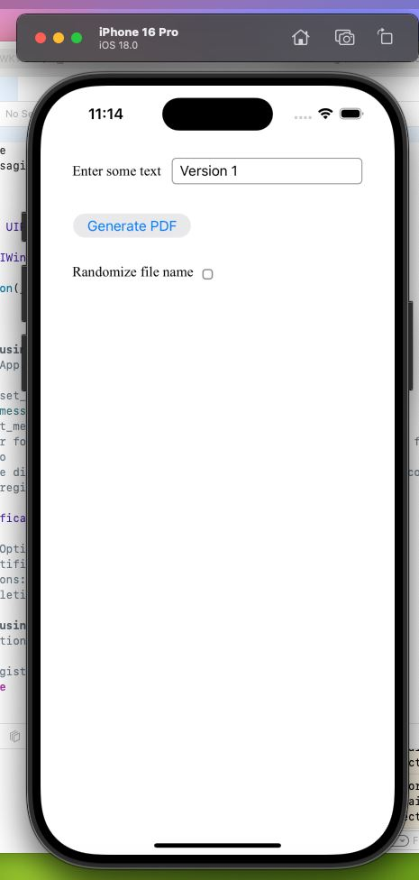

# WKWebViewCache

This demo demonstrates the cache issue when opening a PDF in WKWebView.

-Click [Generated PDF] (it shows "Version1") 
-Change the text (e.g. to "Version 2") 
-Click [Generate PDF] (it still shows "Version 1") 
-Check [Randomize file name] 
-Click [Generate PDF] (Now it shows "Version 2") 

